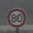

# **Build a Traffic Sign Recognition Classifier** 

## Reflection
In this project the goal was to create a pipieline for the classifcation of traffic signs.

Example image

Example result

Classified by label (some number) with the meaning limit 80kph

### 1. Processing chain

The following items describe the steps of processing.

#### 1 Loading the data
The data is was stored in pickled format and consist of a training set, a validation set and a test set

#### 2 Dataset Summary & Exploration
The data given was imbalanced. For example the ratio of the class with the most samples to the class with the least samples is 11!
The data given was a colored image (three channels)

I created histograms for a visual representation of the representation of the samples (train and validation) and also one sample image in color color with dimensions 32x32.

#### 3 Design and Test a Model Architecture
##### Dealing with the data set
First point is to deal with the shortcomings of the data set. I artifically created additional samples by sampling from the given data and applying
salt and pepper noise (randomly set pixels of the image to either white (255 255 255) or black (0 0 0) ). I also rotated the images by some degrees.

##### Dealing with the data set
Next important step is preprocessing the data.

I applied a reduction (mean of all channels) color to grayscale. My experiments have shown that color does not hold as much information as I believed in the beginning. Since some of the signs hold a specific color like blue or red. But maybe I did not apply the right technique to make use of color :-)
Finally I decided for grayscale in order to increase computing performance.

Also I applied a histogram equalization since some picture are very dark.

Next I normalized so the images have zero mean.

Also the images need to be shuffled to prevent the net to "learn in one direction".

##### Model
The model is exactly LeNet from Yann LeCun with the modification that I increased the dimensions of layer 3 to 300.

I run the net locally on my graphics card. Btw. it took me some time to find out why Jupyter Notebook is not finding the CUDA shared object libraries...
-> You need to pass the environment variables to the jupyter notebook of course.

My model architecture is still based on the LeNet architecture which consists of the following layers:

Input: 32x32x3
Conv 5x5: 1x1 stride, valid padding, 28x28x32
RELU: same dim
Max pooling: 14x14x32
Conv 5x5: 1x1 stride, valid padding, 10x10x64
RELU: same dim
Max pooling: 5x5x64
Flatten: 1600
Fully connected: 800
RELU: same
Fully connected: 512
RELU: same
Fully connected: 43 (classes

I used the Adam optimizer because it worked well in the other example as well. Adam realizes the benefits of both AdaGrad and RMSProp.

"Adaptive Gradient Algorithm (AdaGrad) that maintains a per-parameter learning rate that improves performance on problems with sparse gradients (e.g. natural language and computer vision problems).
Root Mean Square Propagation (RMSProp) that also maintains per-parameter learning rates that are adapted based on the average of recent magnitudes of the gradients for the weight (e.g. how quickly it is changing). This means the algorithm does well on online and non-stationary problems (e.g. noisy)."

Taken from (https://machinelearningmastery.com/adam-optimization-algorithm-for-deep-learning/)

I terminated learning when performance was > 95% on the validation test set.

What architecture was chosen? 
LeNet 5

Why did you believe it would be relevant to the traffic sign application? 
LeNet is a well know architecture to be applied on character recognition as well, so I gave it a try.

How does the final model's accuracy on the training, validation and test set provide evidence that the model is working well? 
Validation perofance while training was > 0.95 (testing > 0.93), which suits the needs for this assignment.

My other hyper parameters are 

Processing:
EPOCHS = 1000 (break statement when performance is >95% on validation -> was the case after only 9 iterations
BATCH_SIZE = 128

Weights:
Mean mu = 0
Standard deviation sigma = 0.1

Learning rate = 0.001 = 1e-3

My performance is > 95% on a more balanced validation dataset with artificial disturbances. My performance on the testset is > 93%

Anyway it is important and good for the generalization to balance the dataset. This can also be seen in the Softmax Probabilities later.

#### 4 Test a Model on New Images

I downloaded 5 images from the web.
One was an artificial image
One was a sign with graffiti on it

The perofance is good. The passing prohibition sign was not classified correctly because I thought this was an easy one. It could be because it is dirty. The next lower softmax probability was the correct one.

When I apply the CNN to six new images from the test set the performance is 80%.
Softmax Probabilities for the candidates after the winner are most of the time several orders of magnitude away from the winner, which is an indicator for 
robustness of the net.

#### 5 (Optional): Visualize the Neural Network's State with Test Images

Not yet done

### 2. Shortcomings

#### A Handling imbalanced data

#### B Preprocessing

#### C LeNet's Model

#### D Learning rate

### 3. Suggest possible improvements to your pipeline

#### A One could invest more time for dealing with the imbalanced data. I only applied salt and pepper and rotation. Different filters (blur or sharpen) could be (additionaly) applied.

#### B Preprocessing could be also enhanced by applying suitable filters (blur, sharpen, edge detection) and/or extracting a ROI.

#### C I think spending time on experimenting with layer sizes can also lead to significantly better results since LeNet was possibly optimized for the ten classes of digits.

#### D Introducing a reduction of the learning rate over time while learning can also improve the classification results.

