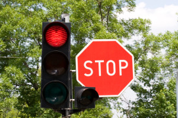

# **Build a Traffic Sign Recognition Classifier** 

Overview of relevant files
---
### Traffic_Sign_Classifier.ipynb --- solution
### Traffic_Sign_Classifier.html  --- solution with output (html)
### Traffic_Sign_Classifier.md    --- short summary
---
